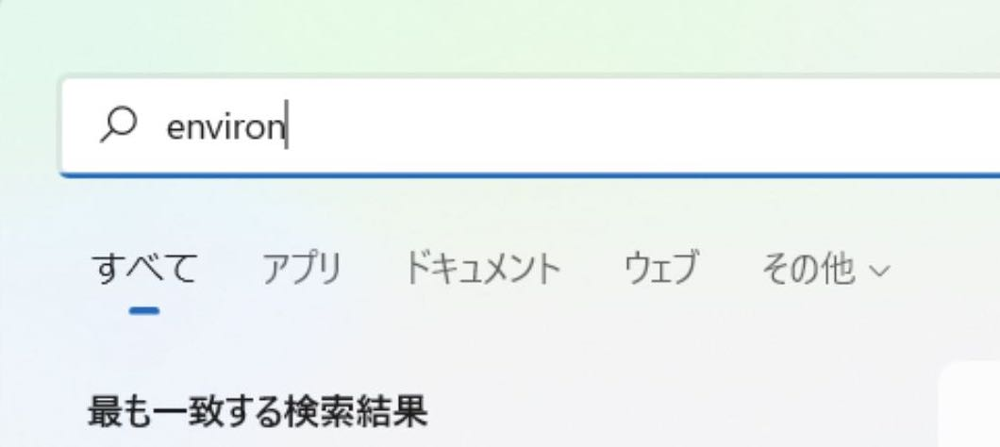
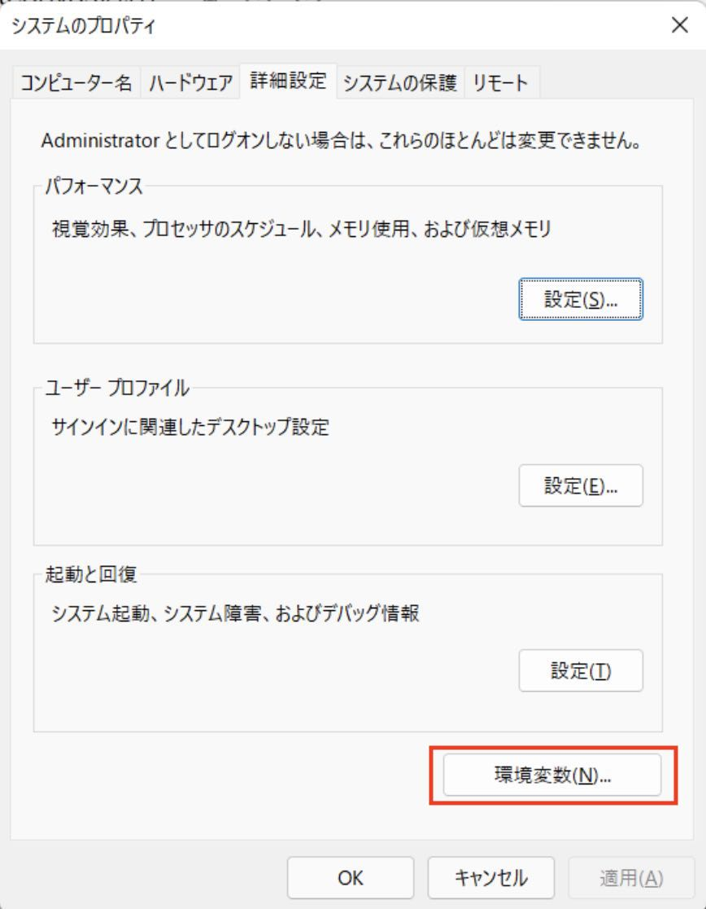
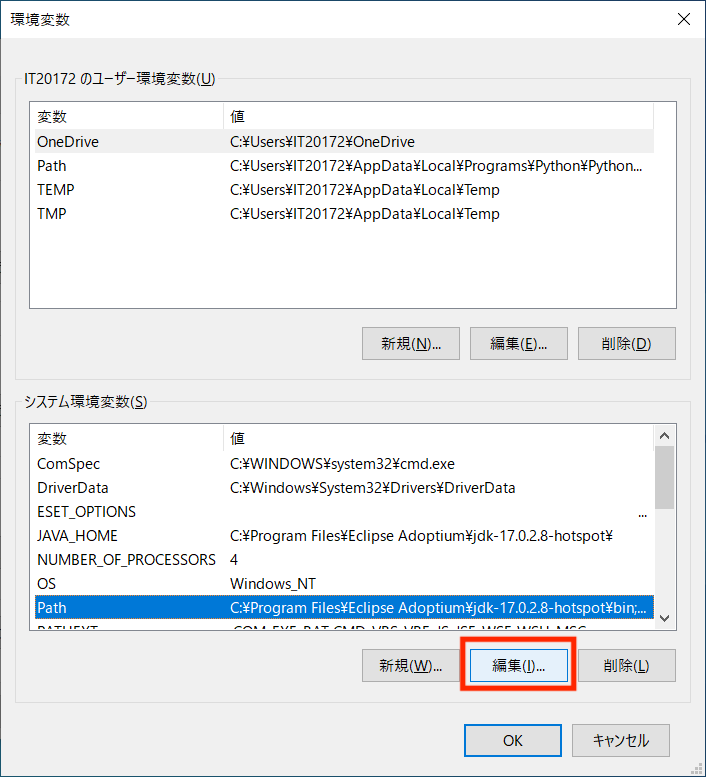
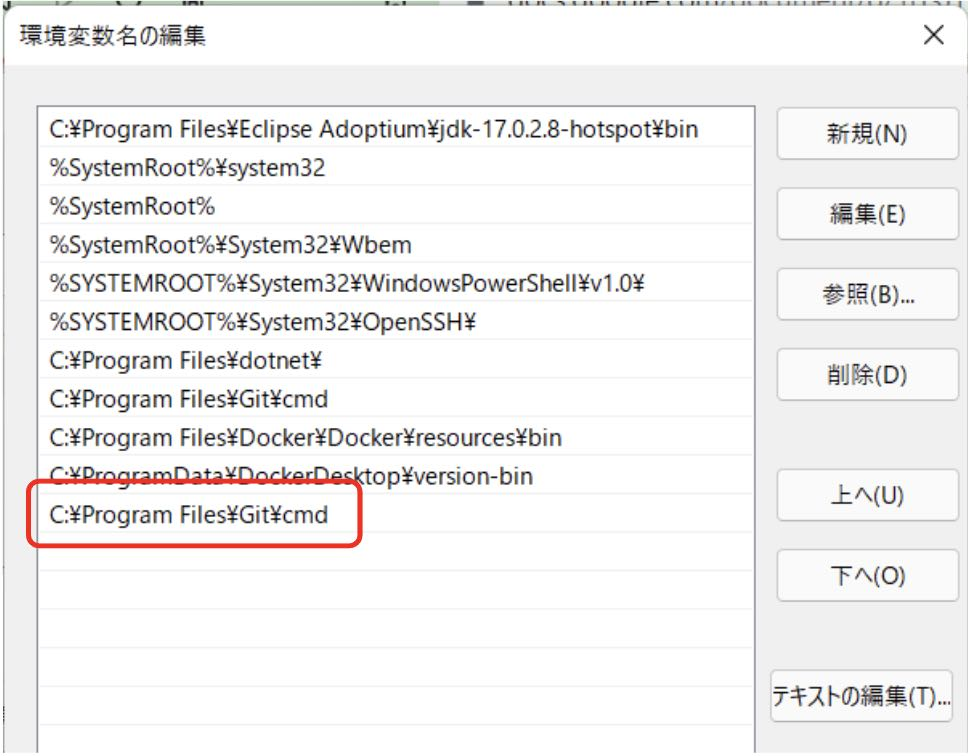

# ロボコン用開発環境構築

- [ロボコン用開発環境構築](#ロボコン用開発環境構築)
  - [Visual Studio Codeのインストール](#visual-studio-codeのインストール)
    - [VSCode(Visual Studio Code)日本語化プラグイン取得](#vscodevisual-studio-code日本語化プラグイン取得)
      - [Japanese Language Pack for Visual Studio Code](#japanese-language-pack-for-visual-studio-code)
    - [Winget](#winget)
  - [Gitのインストール](#gitのインストール)
    - [インストールしたけどgitコマンドが見つからない場合](#インストールしたけどgitコマンドが見つからない場合)
    - [Gitの追加設定](#gitの追加設定)
  - [GitHub](#github)
    - [GitHubアカウント作成(※既にGitHubアカウントを作成済の方は不要)](#githubアカウント作成既にgithubアカウントを作成済の方は不要)

## Visual Studio Codeのインストール

VSCodeは拡張性の高いテキストエディタで、多数のプラグインが利用可能です。
プラグインによりコーディング支援やデバッグ、バージョン管理が容易になり、導入により効率的な開発が可能になります。

1. インストールファイルのダウンロード<br>
Visual Studio Code(以下、「VSCode」と呼ぶ)のWebサイトにアクセスし、ダウンロードする。 2022年4月11日時点では、`VSCodeUserSetup-x64-1.66.1.exe`がダウンロードできる。インストールサイトは[こちら。](https://code.visualstudio.com/Download)<br>


1. インストーラの実行<br>
ダウンロードしたファイルをダブルクリックし、インストーラを起動する。

1. セットアップ開始・インストール先の指定<br>
「同意する」を選択し、「次へ」をクリックする。 デフォルトのまま「次へ」をクリックする。<br>


1. スタートメニューフォルダーの指定・追加タスクの選択<br>
デフォルトのまま「次へ」をクリックする 次の２つのみチェックを入れ、「次へ」。<br>


1. インストール開始<br>
「インストール」をクリックし、インストールを開始する。<br>


1. VSCodeを起動する<br>
「Visual Studio Codeを実行する」にチェックを入れ、「完了」をクリックして、起動させる。<br>


### VSCode(Visual Studio Code)日本語化プラグイン取得

#### Japanese Language Pack for Visual Studio Code

1. VSCodeにて、Ctrl+Shift+Xを同時に押します
1. "Search Extentions in Marketplace"の欄に"japan"と入力します
1. "Japanese Language Pack for Visual Studio Code"のInstallボタンを押します
1. インストール後、再起動を求められるので再起動します
1. VSCodeのメニューなどが日本語になっていればOK。(なお、VSCode自体の更新がかかると、度々日本語化が失われるときがあります。その場合は、このプラグインを再インストールするとOKです。)

### Winget

WingetはWindows 10/11⽤パッケージ管理ツールです。 Wingetを使うことでアプリケーションの検索、インストール、アップデートが簡単にできます。<br>

既にインストールされている場合もあるので、先に確認しましょう。 PowerShellもしくはコマンドプロンプトから `winget -v` コマンドを実行し、バージョン(例：`v1.X.XXXXX`) が表示されれば既にインストールされています。<br>

Wingetを利⽤する場合、Microsoft Storeからインストールを⾏う必要があります。Microsoft Storeで"Winget"と検索すると「アプリ インストーラ」※という名前のアプリが⾒つかります。「アプリ インストーラ」のインストールを⾏ってください。<br>
※「アプリ インストーラ」が正式名称です。⼀般的にWingetと呼ばれていることが多いので、本資料でもWingetと呼びます。 <br><br>
正しくインストールされたか確認したいときは、PowerShellもしくはコマンドプロンプトから、再度 `winget -v` で確認し、バージョン(例：`v1.X.XXXXX`)が表示されればOKです。<br><br>

## Gitのインストール

バージョン管理ツールの一種です。 Gitの詳細については、別途セミナーで学びます。ですので、今回は課題の提出方法として利用することに注力してください。<br>

PowerShellもしくはコマンドプロンプトから下記コマンドを実行する。<br>

```shell
winget install --id Git.Git
```

正しくインストールされたか確認したいときは、`git --version`でバージョン(例:`git version 2.XX.X`)が表示されればOKです。<br>

### インストールしたけどgitコマンドが見つからない場合

`git --version`コマンドを実行した際、`‘git’ is not recognized as an internal or external command`とエラーになることがあります。環境変数がなぜか設定されていない可能性があるので、下記画像を参照に設定してください。<br>

1. Windowsキー → `environ` と入力 → システム環境変数の編集<br>


2. 環境変数を押す<br>


3. 下部のシステム環境変数の`Path`の行を選択し、編集を押す。<br>


4. 新規をクリックし、`C:¥Program Files¥Git¥cmd`を追加する。赤枠内のように設定できればOK。<br>


5. PowerShellもしくはコマンドプロンプトを再起動し、`git --version`を実行し、バージョンが表示されればOK。

<div style="page-break-before:always"></div>

### Gitの追加設定

初めてGitを使う方は、commit(登録)の際に使う名前とメールアドレスを登録しましょう。 PowerShellもしくはコマンドプロンプトから下記コマンドを実行してください。**{}の入力はいりません。自分の名前、メールアドレスは半角英数字で！**

```shell
git config --global user.name {自分の名前}
git config --global user.email {メールアドレス}
```

確認には、下記コマンドを実行します。出力に`user.name`と`user.email`の項目があるので、設定したとおりになっていればOKです。

```shell
git config --list
```

## GitHub

GitHub はGitリポジトリのホスティングサービスです。

インターネット上にリモートリポジトリを用意することで、離れた場所にいるメンバー同士で開発を行ったり、ソースコードを世界中に公開することができます。

### GitHubアカウント作成(※既にGitHubアカウントを作成済の方は不要)

1. GitHubのサイトにアクセスしてください。[GitHubのサイトはこちら](https://github.co.jp/)
2. 画面中央付近にある、緑色のGithub に登録するボタンをクリックしてください。
3. ここから先はUIが英語になります。ユーザー名、メールアドレス、パスワードを入力してください。
4. Verify your accountから指示に従ってアカウント認証を行ってください。
5. 認証が完了したらCreateaccountボタンをクリックします。
6. 登録したメールアドレス宛にEnter codeが送られてきますので、そちらを入力します。
7. アンケートに答えてください。(2回あります。)※アンケートが表示されない場合もあるので、その時はこの作業は無視してください。<br><br>
8. プランの選択画面になりますので、Free(左側)を 選択しましょう。プランはあとから変更できます。※プランの選択画面が表示されない場合もあるので、その時はこの作業は無視してください。<br>


1. 登録完了です。

これで、Git、GitHub、Visual Studio Code の環境構築は終了です。詳細な使い方等はこの資料には記載しませんので、各自で調べてみましょう！
